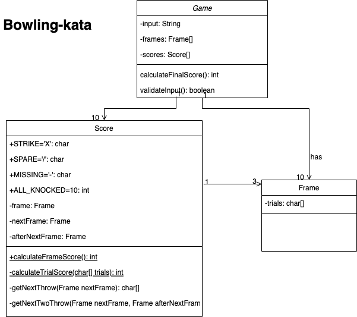

# bowling-kata

## Class Diagram:

## Assumption:
### input - 10 frames, each frame has 1-3 trials
### output - total score

## Approach:
### 1 - Simple, i.e. no strike, no spare
### 2 - with spare case in first 9th frames
### 3 - with strike case in first 9th frames
### 4 - bonus case at 10th round
### 4a - spare case at 10th round
### 4b - strike case at 10th round
### 5 - validation of input